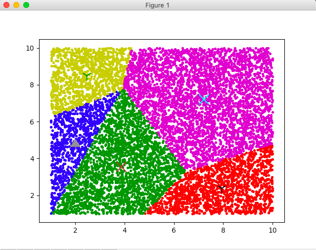
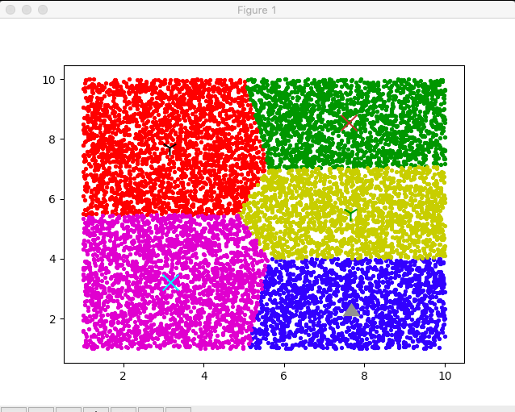

# k-means
This is a kind of cluster method.

## File Configuration :
Using this project, need to import kMeans.py in your file.

Using K-means, need to call functions named cluster and updateCenters.

## Running Example Showing By matplotlib :

### Initial Center :

### Final Result :

