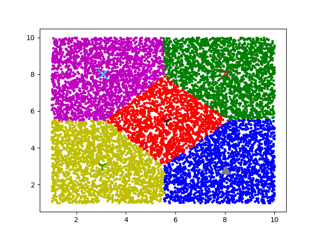

# k-means
This is a kind of cluster method.

## File Configuration :
Using this project, need to import kMeans.py in your file.

Using K-means, need to call functions named cluster and updateCenters.

## Running Example Showing By matplotlib :

### Example 1 : (there are 5 centers)
#### Initial Centers :

#### Final Result :

### Example 2 : (there are 5 centers)
#### Initial Centers :

#### Final Result :

